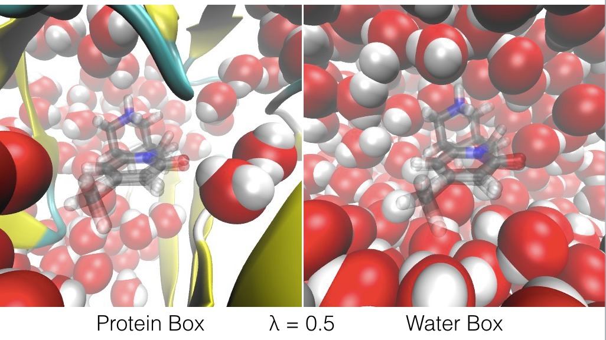

# LigandSwap

This will be a short tutorial on how to use the `ligandswap` method 
implemented in the ligandswap program that comes with [Sire](https://siremol.org) to calculate 
relative binding free energies.

Ligandswap is an efficient and theoretically robust method of predicting 
the relative binding affinities of guest molecules (ligands) to host 
molecules (e.g. proteins).

For example, ligandswap can be used to calculate the relative binding 
free energy of two ligands, A and B, to a protein. It works by 
constructing a λ-coordinate that connects a periodic box of water 
containing ligand A bound to the protein (the `Protein Box`), with a 
second periodic box of water that contains ligand B on its own (the `Water Box`);

The λ-coordinate is used to swap ligands A and B, such that;

at λ=0.0, ligand A is bound to the protein, and ligand B is free in water (as shown above),

at λ=1.0, ligand B is bound to the protein, and ligand A is free in water (as shown below),

and at λ values in between, ligands A and B are both partially bound to the protein, and both ligands A and B are both partially free in water (as shown below).

The free energy change along this ligandswap λ reaction coordinate can be
calculated using any standard free energy method, e.g. 
[free energy perturbation (FEP)](https://en.wikipedia.org/wiki/Free_energy_perturbation), 
[Bennett acceptance ratio method (BAR)](https://en.wikipedia.org/wiki/Bennett_acceptance_ratio) or 
[thermodynamic integration (TI)](https://en.wikipedia.org/wiki/Thermodynamic_integration). 
Indeed, to measure error, the ligandswap program with Sire calculates the free energy using all three methods at the same time.

If you want more information about the theory behind ligandswap, please [take a look here](theory.md).

## Training material

The workshop consists of a series of Jupyter notebooks. These are available below, and can be run using the [workshop Jupyter server](https://ccpbiosim.github.io/workshop/events/bristol2018/server.html).

Once you have started the server, navigate to the `xswaps/ligandswap` directory and you will find all workshop material there.

The workshops are numbered sequentially and should be followed in order. 

## Contents

### [01_running_ligandswap.ipynb](html/01_running_ligandswap.html)

How to run a ligandswap simulation

[download](01_running_ligandswap.ipynb)

### [02_understanding_output.ipynb](html/02_understanding_output.html)

How to understand the output of a ligandswap simulation

[download](02_understanding_output.ipynb)

### [03_simulation_options.ipynb](html/03_simulation_options.html)

How to set the options of a ligandswap simulation

[download](03_simulation_options.ipynb)

### [04_analysis.ipynb](html/04_analysis.html)

How to analyse the outputs from ligandswap

[download](04_analysis.ipynb)

### [05_interactive_analysis.ipynb](html/05_interactive_analysis.html)

How to do a deeper analysis of the ligandswap free energy

[download](05_interactive_analysis.ipynb)

### [06_components.ipynb](html/06_components.html)

How to decompose the relative binding free energies to residue-based
components, and then visualise them in 3D.

[download](06_components.ipynb)

### [Theory](theory.md)

Theory behind LigandSwap

